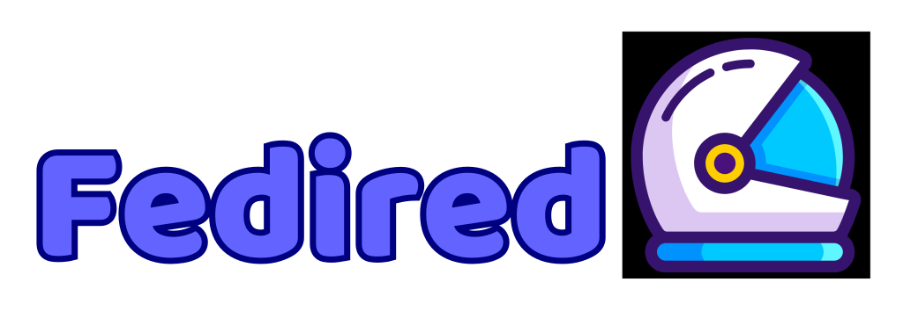

  

# 🌎 **Fedired: Open-source, decentralized social media platform – Free forever!** 🚀

**Fedired** es una plataforma de redes sociales descentralizada y de código abierto. Aprovechando el protocolo **ActivityPub**, Fedired ofrece a los usuarios la capacidad de comunicarse y compartir contenido de manera segura y privada. En un mundo donde las redes sociales centralizadas comprometen la privacidad de los datos, Fedired se erige como una alternativa, empoderando a los usuarios para que tengan el control total de su experiencia social en línea.

  
    

  

> [!WARNING]
>
> ¡Hola a todos! Queremos informar a nuestra comunidad que actualmente estamos enfrentando algunos problemas con las actualizaciones de Fedired. Agradecemos su paciencia mientras trabajamos para resolver estos inconvenientes.
>
> **¿Cómo puedes ayudar?**
>
> Si tienes experiencia en desarrollo o administración de sistemas, cualquier apoyo será muy apreciado. **¡El apoyo es completamente voluntario!**
>
> Gracias por su comprensión y apoyo continuo.
>
> El equipo de Fedired

## Navigation

- [Instancia Oficial](https://fedired.com)
- [Documentacion](https://help.fedired.com)
- [Repositorio Oficial](https://github.com/fedired-dev/fedired)
- [Donaciones](https://patreon.com/fedired)
- [Traduciones](https://crowdin.com/project/fedired)

## Features

- **Interfaz totalmente personalizable**: Ajusta la apariencia y el diseño de tu instancia para que refleje tu estilo personal.
- **Reacciones emoji**: Utiliza una amplia variedad de emojis para expresar tus emociones en cada publicación o comentario.
- **Sistema de chat flexible**: Disfruta de una mensajería en tiempo real, con la posibilidad de crear grupos y mantener conversaciones privadas.
- **Descentralizado y de código abierto**: Los usuarios tienen el control total de sus datos y pueden contribuir al desarrollo de la plataforma.
- **Integración con el Fediverse**: Conéctate y comparte contenido con otras instancias de redes sociales que utilizan el protocolo **ActivityPub**.

## Preguntas Frecuentes (FAQs)

**¿Es Fedired realmente gratis?**  
Sí, **Fedired** es completamente gratuito y siempre lo será.

**¿Cómo se protege mi privacidad en Fedired?**  
**Fedired** se compromete a proteger la privacidad de sus usuarios y no vende datos personales.

## ¡Únete a Nosotros!

**Fedired** es más que una plataforma; es un movimiento hacia una red social más privada y descentralizada. ¡Únete a nuestra comunidad y ayuda a dar forma al futuro de las redes sociales!

- **Contribuye en [GitHub](https://github.com/fedired-dev/fedired)**
- **Haz una donación en [Patreon](https://patreon.com/fedired)**

## Importante:
Fedired es una bifurcación del proyecto Firefish, que a su vez era un fork de Misskey. Dado que Firefish ya no es mantenido, hemos decidido tomar el código y continuar su desarrollo para perfeccionarlo y adaptarlo a nuestras necesidades.

